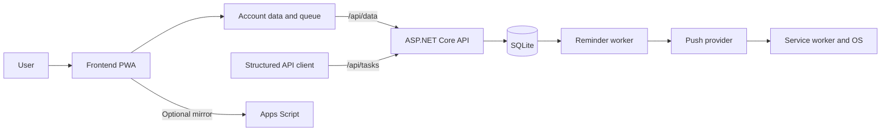

# TaskFlow Pro — Complete Application Documentation

Updated **10 October 2026** (Africa/Cairo). This is the single maintained application guide: user workflows, alarms, architecture, API, setup, deployment, testing and limitations. It replaces the separate guides and historical audit files, whose original versions remain in Git history.

## Contents

- [Release and hosting status](#release-and-hosting-status)
- [User guide](#user-guide)
- [Notifications](#notifications)
- [Architecture](#architecture)
- [API reference](#api-reference)
- [Frontend setup and data operations](#frontend-setup-and-data-operations)
- [Backend setup and operations](#backend-setup-and-operations)
- [Google Sheets integration](#google-sheets-integration)
- [Verification and remaining checks](#verification-and-remaining-checks)
- [Test evidence and history](#test-evidence-and-history)
- [Troubleshooting and limitations](#troubleshooting-and-limitations)

## Release and hosting status

| Component | October 10 evidence |
|---|---|
| Website | [TaskFlow Pro](https://ahmedadel1998.github.io/TaskFlow-Pro/) |
| Repository | [GitHub](https://github.com/AhmedAdel1998/TaskFlow-Pro) |
| API | `https://api-production-1da6.up.railway.app` |
| Application commit | [794d126](https://github.com/AhmedAdel1998/TaskFlow-Pro/commit/794d126) |
| CI and Pages | [Run 38042883578](https://github.com/AhmedAdel1998/TaskFlow-Pro/actions/runs/38042883578): both test jobs and deployment passed |
| Live frontend | `app.js?v=20261010-1`, worker cache `taskflow-v14`; automatic task/block times and both editor hints verified in a fresh browser without page errors |
| Live backend | Railway deployment `1d2f9f5f-3605-4046-88b8-5cc6dc92cd6c` succeeded; readiness returned `ready`; all three VAPID settings present |

These are dated release observations, not continuous monitoring or proof of real OS notification receipt. **The owner retained Railway Free with no billing change.** It requires server sleep and rejected disabling it. The checked-in `sleepApplication: false` is intended configuration, not the effective production setting (`true`). Closed-app reminders can be missed while the API sleeps.

## User guide

### Account

Registration and login require a **username** (3–32 characters: letters, numbers, underscores) and a **password** (6+ characters). This is real server-side authentication — the backend hashes passwords and issues short-lived JWT access tokens plus long-lived rotating refresh tokens. There is no anonymous/local-only mode; an account is required to use the app.

### Dashboard

- Total / completed / in-progress / overdue task counts
- Weekly completion chart, priority distribution, productivity heatmap
- Upcoming deadlines, goal progress, habit streaks, recent activity
- **Today's Focus** widget: a short, prioritized list of what most needs attention right now (overdue items, due-today items, goals falling behind pace)
- Filters: date range, project, owner

### Tasks

Fields: title, description, priority, category, project, owner, Eisenhower quadrant, due date/time, status, progress, estimated/logged hours, link, notes, tags, recurrence, optional **custom reminder** (date + time), **Important (alarm)** flag, milestone flag, dependencies, subtasks, comments.

Shortcuts: `Q` quick add, `/` focus search, `Alt+N` new task modal, `Escape` close overlays.

Quick add syntax: `Prepare report !high @Work #finance ~ProjectName` — supports `!priority`, `@category`, `#tag`, `~project`.

### My Day

Shows tasks due today and tasks added to today's plan, grouped into morning, afternoon and evening. Save a daily note and track completion. Broad day slots do not set exact alarm times.

### Kanban and Eisenhower Matrix

Kanban groups the same tasks by status; transitions persist and respect dependencies. The matrix uses explicit or calculated urgency/importance quadrants. Neither creates a separate store.

### Projects

Create projects with name, color and description, associate tasks and filter/report by project. PWA projects belong to the account; structured API projects are a separate organization model.

### Goals

Create weekly/monthly goals with title, target, current value and unit. Link to a project, category or habit for activity-derived progress; unlinked goals use entered progress.

### Habits

Create habits and record completion on local dates. History drives consistency and streaks. Habit tracking does not itself schedule task alarms.

### Notes

Create, edit and search notes, with folder/pin organization. Notes are separate from task notes. Rendered text is escaped; this is not a general rich-document editor.

### Analytics and Reports

Analytics summarizes task activity. Reports total logged hours by category, project and completion day. Enter hours manually or save Pomodoro time; reports describe recorded work, not automatic computer monitoring.

### Archive

Archive removes tasks from active work while preserving restoration. Deletion and clearing the archive are separate operations. Standard JSON exports exclude the archive.

### Calendar

Events support title, date/time/end time, type (meeting/event/reminder/deadline), color, description, a **"Remind me"** interval (none / at the time / 10 / 30 / 60 minutes / 1 day before), and an **Important (alarm)** flag.

### Timetable

Supports manual time blocks with a date, start/end times, priority, completion, and an alarm. Auto-assigns tasks around reserved blocks across the day's available hours based on estimated duration, priority, and due date — a lightweight daily schedule generated from your task list rather than something you build by hand.

### Life Balance

Tracks time allocation across life areas and reports back against general well-established time-use guidance, so you can see where your logged hours are actually going versus where you intend them to go.

### Progress

- Auto-calculated activity/progress charts from real task completion and habit data
- Self-competition "Beat Your Record" challenges
- **Achievements**: badges computed live from your existing data (no separate tracking to maintain), shown once per unlock via a toast and permanently in a badge grid

### Review (Weekly Review)

A dedicated weekly page: goal progress vs. expected pace, habit consistency (30-day window), task-completion velocity, a life-balance summary, and a suggested focus area for the week ahead.

### Pomodoro Timer

Work/break duration, session count, optional task linking, and saving focus time back to a task. Configured in Settings.

### Task lifecycle and settings

Titles require at most 200 characters. Complete prerequisite tasks before dependent work; reopening clears completion state. Cyclic dependencies lack comprehensive editor diagnostics. Search/filter by supported title/tag/status/priority/category/project/owner fields, save filter combinations, and reuse task templates. Bulk actions affect selected tasks. Owner labels do not grant other accounts access to your PWA data.

Recurrence processing runs in the app, not an independent server job. Monthly recurrence clamps to valid month-end dates. Review new occurrences' date/time and alarms: the original reminder is not automatically copied.

Settings includes Account Database URL/status, conflict resolution, notifications, language/RTL, Pomodoro durations, import/export, optional Sheets configuration and Clear All Data. Theme/install controls are available. Registration creates an organization/Owner automatically. Initial sign-in needs connectivity; previously loaded work can queue offline, but logout requires online authentication to return. No anonymous mode exists.

### Backups, language and installation

JSON exports contain tasks, projects, goals, habits and notes only. Calendar, archive, timetable, daily notes, preferences and other sections are excluded. CSV and Excel are task reports, not full restore formats. Excel requires the external XLSX library/CDN. Import JSON by reviewing validation/preview and confirming replacement; invalid/oversized sections and duplicate IDs are rejected. Storage failures roll back affected writes.

Clear All Data queues server deletions to prevent hydration resurrecting data; connectivity is needed to enumerate server sections. Preserve unsynced work before clearing storage. For full recovery use SQLite's backup mechanism and preserve private configuration; do not copy only a live database without its WAL state.

English/Arabic/RTL share canonical data. PWA installation and notification permission are separate browser features. Responsive navigation supports mobile/desktop. Full screen-reader, contrast and touch certification remains incomplete. Life Balance scores are planning aids, not medical assessments. Browser suspension can affect Pomodoro and other timers.


## Notifications

When Important (alarm) is checked, tasks use their due date and due time; manual timetable blocks use their date and start time. The separate reminder field is optional and overrides that time when filled. A task without a due time must supply one or a custom reminder. Changing the effective time rearms the alarm. The client saves the resolved UTC instant for the server, preserving the editing device's time zone and DST rules.

The server independently checks synced reminders every 10 seconds. It sends Web Push without an open application tab. Successful provider submissions are tracked separately for each subscription; a failed device retries even if another succeeds. Local display no longer cancels delivery to other devices. Provider acceptance is not a device-delivery receipt. Existing five-minute lateness/retry limits remain; outages longer than this can miss reminders. Multiple API replicas are not supported by the current dispatcher.

Background subscription errors now appear to the user. Permission alone is insufficient: the browser subscription must also be registered with the authenticated backend, and the item must finish syncing before the app is closed. The frontend and backend must both be deployed for these changes to apply.

### Notification test scope

- Backend integration tests cover automatic task and timetable scheduling without custom reminders, per-device retry, expired subscriptions, duplicate ticks, custom reminders, time edits, completed and dismissed records.
- Frontend unit tests cover automatic times, custom overrides, midnight, missing task time and disabled alarms. Service worker tests simulate push, Arabic copy and notification clicks; they do not contact a real push provider.
- Browser tests exercise the actual task and timetable editors, persisted UTC values, and rearming after a time edit in Africa/Cairo.

### Device acceptance

1. Both components are deployed and all three VAPID settings are present. A continuously running backend remains unavailable under the retained Free plan. Obtain explicit billing approval before changing plans; then verify sleep is actually disabled. Use one replica and persistent storage. Keep the key pair stable across restarts.
2. Sign in on the target browser and enable notifications. Confirm the success message and completed data sync.
3. Create a task and a time block several minutes ahead with Important checked and the reminder field empty. Close all TaskFlow tabs; verify actual OS notifications arrive and open TaskFlow when clicked.
4. Repeat on each supported device, with the browser window closed, with the device locked, and after a backend restart. Record expected time, observed time, browser/OS and outcome separately.
5. Verify rescheduling, completion before delivery, blocked permissions, network interruption and a failed device while another succeeds.

Web Push can run while the app is closed, but browser/OS background restrictions, connectivity, notification settings and power management affect delivery. Arbitrary looping alarm audio is available only while the page runs; background notification sounds are controlled by the OS. No web application can guarantee delivery while the device is powered off.

Reference: https://developer.mozilla.org/en-US/docs/Web/Progressive_web_apps/Guides/Offline_and_background_operation

### Examples and timing boundaries

An Important block from 11:00 to 15:00 with Reminder empty notifies at 11:00; moving the start to 12:00 rearms it. A filled custom Reminder overrides the default. Without Important and without a reminder there is no automatic notification. Calendar events retain their selected Remind me interval. Generated task timetable slots do not override a task's due-time alarm.

The open page checks every second; a server scan every ten seconds is not a guarantee of exact arrival. Setup success confirms subscription registration, not uptime or OS receipt. Local and push paths do not guarantee exactly-once presentation. Legacy records without UTC timestamps use the subscription offset until re-saved; ambiguous DST times follow browser date behavior. Disable push removes this browser subscription; browser permission is a separate state.


## Architecture

### Overview

TaskFlow Pro is a productivity and task-tracking platform designed for personal and small-team workflows. It combines a browser-based progressive web app (PWA) with a secure ASP.NET Core API and SQLite database to provide task management, calendar-like planning, reminders, organization-level isolation, and offline-friendly syncing.

The project is intentionally split between two runtime layers:

- A frontend PWA built with vanilla JavaScript, HTML, CSS, and a service worker for offline behavior.
- A backend API built with ASP.NET Core 9, EF Core, and SQLite for authentication, task/project APIs, per-user data storage, and push notifications.

This architecture allows the app to work smoothly in a browser while keeping shared data and security boundaries on the server side.

---

### Project purpose and goals

TaskFlow Pro aims to deliver:

- Task creation, editing, prioritization, due dates, and status tracking.
- Project-based organization and workspace separation.
- Server-driven reminders with the app closed, subject to an awake backend and browser/OS delivery support. Railway Free currently enforces server sleep.
- Browser-first offline operation with delayed sync when connectivity returns.
- Secure multi-user workspace boundaries through organization-scoped access.
- API-first synchronization for persistence and conflict handling.

The project is especially well-suited for:

- Individuals managing personal workload.
- Small teams or workspaces operating inside a shared organization.
- Users who want a lightweight app with strong browser convenience and server-backed security.

---

### At-a-glance feature summary

### Core features

- Task lifecycle management: create, update, complete, and archive tasks.
- Projects and task organization by workspace/organization.
- Subtasks, comments, tags, and project assignment.
- Due dates, timestamps, and versioned updates.
- User-scoped browser data with server-side sync.
- Push notifications for reminders using VAPID-supported browser push.
- Offline queueing and conflict resolution for local edits.
- Authentication with username/password, JWT access tokens, and rotating refresh tokens.
- Rate limiting on auth endpoints.
- Health endpoints and readiness checks for deployment and operations.

### Product differences worth noting

The project includes both:

1. A browser-local PWA data model for offline productivity features
2. A structured server-side task/project API for organization-scoped records

These are intentionally separate models. The app’s browser-local store and the structured API do not automatically mirror each other. This separation helps preserve compatibility and avoids mixing UI state and server-managed records in the same storage model.

---

### Frontend layer

The frontend is a dependency-light PWA built with vanilla JavaScript. It manages:

- Authentication and token refresh
- Local browser persistence and sync state
- Offline queueing for data writes
- PWA features such as installation, cache, and service worker registration
- Task UI, reminders, filters, goals, habits, notes, and other productivity elements

The app uses browser `localStorage` to hold each user’s data and queued writes. When connectivity is available, it pushes queued values to the API through authenticated endpoints.

Key frontend characteristics:

- Uses `window.TASKFLOW_CONFIG.apiBaseUrl` and `localStorage.taskflow_api_url`
- Automatically retries sync when the user returns online
- Maintains a pending queue to avoid losing writes during offline periods
- Uses optimistic concurrency checks on `/api/data` writes

### API layer

The API is composed of `TaskFlow.Api`, `TaskFlow.Application`, `TaskFlow.Infrastructure`, and `TaskFlow.Domain`.

- `TaskFlow.Api`: HTTP endpoints, CORS, authentication, rate limiting, health checks
- `TaskFlow.Application`: command/DTO model and service boundaries
- `TaskFlow.Infrastructure`: database access, JWT issuance, push services, background worker
- `TaskFlow.Domain`: core entities and enums

The startup code in [Program.cs](backend/src/TaskFlow.Api/Program.cs) registers services and middleware. Routes use application services alongside direct startup and authentication database checks.

### Persistence layer

SQLite is used as the authoritative data store for backend-managed records. The database layer uses EF Core and defines indexes and unique constraints for key records such as:

- Users and organizations
- Organization membership
- Projects and tasks
- Refresh sessions
- User data entries
- Push subscriptions
- Reminder deduplication records

The database context also converts `DateTimeOffset` values to Unix timestamps to support SQLite ordering and comparisons reliably.

This is an important implementation detail because SQLite does not natively support the same `DateTimeOffset` semantics as SQL Server or PostgreSQL.

---

### Domain model

The domain includes common workspace concepts:

- `User`: account identity and password hash
- `Organization`: top-level workspace container
- `OrganizationMember`: membership and role assignment
- `Project`: grouping of tasks
- `TaskItem`: a task with title, status, priority, due date, and versioning
- `RefreshSession`: single-use refresh token tracking
- `Subtask`, `TaskComment`, `Tag`, `TaskTag`: structured task metadata
- `UserDataEntry`: per-user generic browser data store
- `PushSubscription`: browser notification subscription
- `SentReminder`: deduplication state for notifications

Structured tasks use `Version` for concurrency; generic account sections use update timestamps. Neither mechanism performs automatic field-by-field merging.

---

### Authentication model

TaskFlow uses:

- Username/password registration
- JWT access tokens valid for 15 minutes
- Rotating refresh tokens valid for 30 days
- Organization-scoped claims using `sub` and `org`

The application validates the JWT and checks the user is still valid and still belongs to the organization in the token.

### Authorization behavior

Every protected endpoint resolves the current user and organization from the token and then checks membership before proceeding. This protects data separation across organizations.

### Security behaviors included

- Username normalization to lowercase and validation
- Password length validation
- Rate-limiting on login and auth requests
- Refresh token reuse prevention and revocation
- Sticky organization membership enforcement
- `UnauthorizedAccessException` and `DbUpdateConcurrencyException` handled in middleware
- `X-Content-Type-Options` and `Referrer-Policy` response headers

---

### Data sync and offline behavior

One of the most important project concepts is the split between browser-local storage and the backend API.

### Local-first sync design

The frontend writes to browser storage and queues pending writes in per-user storage keys such as:

- `taskflow_tasks_<user>`
- `taskflow_projects_<user>`
- `taskflow_activity_<user>`
- `taskflow_pending_sync_<user>`

The app then uploads the queued values to `/api/data/{key}`. This provides offline resilience and avoids losing user changes when the network is poor or temporarily unavailable.

### Conflict handling

Because browser and server state may diverge during offline use, the API allows concurrency-aware writes. If a stale update is sent, the server responds with conflict status and the local queue is retained.

This is supported by the `ExpectedUpdatedAt` and `RequireVersion` fields in `UpsertDataCommand`.

The app will show conflict resolution screens and allow manual resolution by choosing between local and server versions.

---


### Repository map and source of truth

`frontend/` holds the static PWA, assets and tests; `backend/` holds the .NET solution, four source layers, integration/runtime tests, Dockerfile and Railway configuration. `integrations/google-sheets/AppsScript.gs` is the optional mirror. `.github/workflows/deploy.yml` controls CI/Pages. `artifacts/` contains generated local evidence. This README is the only maintained application document.

PWA task creation writes local account data and queues `/api/data/{key}`; it does not POST `/api/tasks`. Structured task/project APIs remain separate organization tables and do not automatically appear in the PWA or schedule PWA reminders. Sheets is called by the frontend, not the API. Implementing cross-model projection would require an explicit migration.




## API reference

Routes: [Program.cs](backend/src/TaskFlow.Api/Program.cs). Payloads: [Contracts.cs](backend/src/TaskFlow.Application/Contracts.cs). Protected calls require `Authorization: Bearer <access-token>`.

| Method | Route | Purpose |
|---|---|---|
| GET | `/health/live`, `/health/ready` | Process/database health |
| POST | `/api/auth/register` | username, password, organizationName → tokens/organization |
| POST | `/api/auth/login` | username, password → tokens |
| POST | `/api/auth/refresh`, `/api/auth/logout` | refreshToken → rotate/revoke |
| GET / POST | `/api/tasks` | List/create structured tasks |
| PUT | `/api/tasks/{id}` | Update structured task/version |
| GET / POST | `/api/projects` | List/create projects |
| GET / POST | `/api/tasks/{taskId}/subtasks` | List/create subtasks |
| PUT | `/api/tasks/{taskId}/subtasks/{id}` | Update subtask |
| GET / POST | `/api/tasks/{taskId}/comments` | List/add comments |
| GET / POST | `/api/tags` | List/create tags |
| GET | `/api/data` | List owned PWA sections |
| PUT / DELETE | `/api/data/{key}` | Version-aware section upsert/delete |
| GET | `/api/push/vapid-public-key` | Public subscription key; 404 if absent |
| POST | `/api/push/subscribe` | endpoint, p256dh, auth, tzOffsetMinutes |
| POST | `/api/push/unsubscribe` | Remove owned endpoint |

There is no general structured delete route for every entity. UI deletion uses account sections. `value` in a section upsert is a JSON string; use the latest server timestamp as `expectedUpdatedAt` (null for a new section) and `requireVersion: true`. Typical errors: 400 input, 401 authentication, 404 missing/inaccessible, 409 conflict, 429 rate limit, 500 internal failure. Errors are not saved-change acknowledgments.


## Frontend setup and data operations

Independent vanilla JavaScript PWA. Runtime files contain no dependency on backend source, .NET, or a shared filesystem. All account traffic uses HTTP APIs.

### Install and run

Requires Node.js 20+ for the development server/tests. Static hosting itself needs no Node installation.

```powershell
cd frontend
npm ci
npm start
```

Open `http://127.0.0.1:8000/` or `http://127.0.0.1:8000/TaskFlow-Pro/`. Start the API separately following [backend instructions](#backend-setup-and-operations).

`config.js` is public configuration, loaded before `app.js`. Set `window.TASKFLOW_CONFIG.apiBaseUrl` to the independently hosted API URL, without a trailing slash. The checked-in default is `http://localhost:5299`; local tests never select production. An existing `localStorage.taskflow_api_url` override takes precedence. Remove that override when changing `config.js`. No secrets belong here.

HTTP/HTTPS hosting is required for a realistic PWA test. Avoid `file://`. For a custom local API port, add its origin to the HTML CSP `connect-src` directive as well as configuring its URL. Backend CORS must allow the frontend origin. The development API allows loopback origins; production uses an explicit allowlist.

### Tests

```powershell
npm run test:syntax
npm run test:unit
npm run test:smoke
npm test
```

Syntax and unit tests run independently without .NET. The browser integration test requires the sibling backend checkout, .NET 9 SDK, and installed Chrome or Edge on Windows. It launches a disposable SQLite API on an OS-selected available port (allowed in the test server's HTML CSP only) and a temporary HTTP frontend, tests `/TaskFlow-Pro/`, and stops both processes. It does not use your development database. Mocked request-race tests and real API/browser tests are separately reported. See [verification](#verification-and-remaining-checks).

`npm run test:responsive` checks 17 populated screens and 12 dialogs in English and Arabic at widths from 320 to 1440 pixels. It verifies document overflow, timetable dimensions, fixed blocks outside working hours, and block editing/completion. Screenshots are written to `../artifacts/`. Set `RESPONSIVE_URL` to the hosted frontend URL (including its trailing slash) to repeat the checks against deployed assets; the test uses an isolated browser and blocks external API requests.

### Deploy

Publish only `index.html`, `app.js`, `config.js`, `styles.css`, `sw.js`, `manifest.json`, and the two icons. Set the public API URL in the deployed `config.js`. Relative asset URLs, manifest start URL/scope, and service worker registration support both `/` and `/TaskFlow-Pro/`.

The root GitHub workflow stages only those files. Configure repository variable `TASKFLOW_API_URL` to an HTTPS API origin before publishing. The workflow refuses an empty/invalid URL. Bump the service-worker cache name and the versioned `app.js` URL together when changing the shell. The 2026-10-10 release was published and verified with `app.js?v=20261010-1` and service-worker cache `taskflow-v14`.

### Persistence and conflicts

The PWA uses `/api/data` as its server store. Task/project structured endpoints are a separate API model, not a second PWA store. Reminder scanning reads the same generic data as the PWA.

Data and pending queues are account-scoped. Pending edits survive HTTP errors and hydration. Version-checked writes return 409 when another device changed the same section; the local queue is retained. Use Settings → Resolve sync conflicts to save both versions and explicitly choose the local or server version. Conflicts are per section (for example the whole tasks array), not a collaborative per-field merge.

The former shared template key is retained but not automatically attributed to a user. Recover legacy templates only after confirming their owner. Browser-local storage is not encrypted and is not a security boundary against someone controlling the same browser profile; use separate OS/browser profiles for mutually untrusted users. Logging out removes cached authentication credentials; offline login after logout is unavailable until authenticating again.

JSON backups currently cover tasks, projects, goals, habits, and notes; calendar, archive, timetable, and preferences are synced but are not part of that JSON format. Excel requires the existing CDN library; an unavailable library produces an error message. Daily digests and snooze run only while the app is open. Real push/device behavior requires manual verification in the matrix.


## Backend setup and operations

Independent ASP.NET Core 9 API, Application, Infrastructure, and Domain projects with EF Core SQLite. The frontend is not copied into the API or required at runtime.

### Install, configure, run

Install the .NET 9 SDK. From this directory:

```powershell
dotnet restore TaskFlow.sln
dotnet build TaskFlow.sln
dotnet run --project src/TaskFlow.Api --launch-profile http
```

The development API listens on `http://localhost:5299`. Check `/health/live` and `/health/ready`. Startup applies the preserved SQLite migrations and enables WAL. Development configuration has an explicitly development-only JWT key; push is disabled until VAPID is configured.

**Existing data:** set `ConnectionStrings__TaskFlow` to the absolute path of your existing database before launching from the new directory. Relative SQLite paths depend on the working directory. The reorganization moved the old `src` tree intact; no database was reset or deleted. Back up the database with SQLite's backup mechanism before operational migration; do not copy only a live `.db` while ignoring its WAL.

Environment examples are in [backend/.env.example](backend/.env.example). .NET does not automatically load `.env`: set environment variables in your shell or hosting provider. In PowerShell use `$env:Jwt__Key='...'`. Production startup rejects missing/short JWT keys and the known development placeholder.

### Test

```powershell
dotnet test TaskFlow.sln --logger "trx;LogFileName=backend.trx"
dotnet publish src/TaskFlow.Api -c Release -o artifacts/publish
```

Tests use isolated temporary SQLite databases, migrations, and the real HTTP pipeline. Push transport is mocked in reminder tests; real browser delivery is not implied. The frontend integration suite additionally runs the API as a separate local process.

### Docker and Railway

Build context is **this `backend/` directory**:

```powershell
docker build -t taskflow-api .
docker run --rm -p 8080:8080 --env-file .env -v taskflow-data:/data taskflow-api
```

Use a generated secret JWT key (32+ characters), `ConnectionStrings__TaskFlow=Data Source=/data/taskflow.db;Default Timeout=30`, `ASPNETCORE_HTTP_PORTS=8080`, and `Cors__Origins__0=https://your-frontend.example`. Mount the persistent volume at `/data`. Never store JWT/VAPID secrets in an image or repository.

For Railway configure service Root Directory `/backend`, config file `/backend/railway.json`, Dockerfile `Dockerfile`, and a persistent volume at `/data`. The API honors Railway's `PORT`. Readiness probes use `/health/ready`. Railway's repository-triggered deployment is independent of GitHub Pages' CI gating; do not assume a failed Pages job prevents an API deployment. Commit `794d126` was deployed successfully on 2026-10-10. Railway rejected a config-file-setting update because its API now deprecates Config as Code in favor of Infrastructure as Code, and separately rejected `sleepApplication: false` under the Free plan. The checked-in setting does not prove that sleep is disabled; verify the effective service/deployment configuration. Do not upgrade billing without owner approval.

The previously committed VAPID private key was removed. If it was ever used, rotate that key in the hosting provider and renew browser subscriptions. A git working-tree removal cannot revoke a previously exposed key or remove it from history.

### API and data boundaries

- `/api/auth/register`, `/login`, `/refresh`, `/logout`: username/password login, rotating refresh sessions, logout refresh revocation. Already-issued access JWTs expire after 15 minutes; logout does not instantly revoke them.
- `/api/data`: per-user PWA sections. PUT accepts `{value, expectedUpdatedAt, requireVersion:true}`; timestamps serve as optimistic concurrency versions. A stale write returns 409. Legacy clients omitting version checks retain last-write-wins behavior for compatibility.
- `/api/tasks`, `/api/projects`, subtasks, comments, tags: separate organization-scoped structured API. It has no automatic projection into `/api/data`; it is not the PWA source of truth. Structured task creation does not schedule PWA reminders. Do not mix the two models expecting automatic synchronization.
- The reminder worker scans every 10 seconds while the API is running. Important tasks with no custom reminder use `due` plus `due_time`; important manual blocks use `date` plus `start` (minutes from midnight). Explicit reminders override these defaults. Calendar events continue to use `remindBefore`. Successful push submissions are tracked per subscription and trigger; failures on another device can retry. Client records marked `reminderDelivery: local` do not suppress server delivery to other devices.
- Push subscriptions are per user. Endpoints are limited to supported browser push providers. Timed task/event/timetable reminders read `/api/data`. New clients include trigger UTC timestamps, so future DST changes are resolved when editing. Legacy records fall back to the stored subscription offset until re-saved.

Use one API replica with a persistent local SQLite volume. Multi-replica push dispatch is not coordinated, and shared network filesystems are not a supported SQLite deployment. A push accepted by its provider is not proof of device delivery. Retries occur within the five-minute reminder window; delivery after a longer outage is not guaranteed.

MFA, invitations, email verification, password reset, role-based policy beyond membership, and audit logs remain unimplemented. See the [verification](#verification-and-remaining-checks) for evidence and limitations.


## Google Sheets integration


[AppsScript.gs](integrations/google-sheets/AppsScript.gs) is the legacy, optional Google Sheets integration. The PWA and API do not require it. Configure `SPREADSHEET_ID` and `SYNC_TOKEN` in Apps Script Properties, deploy it as a web app, and enter the URL/token in the frontend settings. Never commit deployment credentials.

This mirror is separate from `/api/data`, not transactional, and is not the application source of truth. Push/pull is explicit. Pull can replace local task data after confirmation. Account exports are restricted to the currently signed-in user. Real Apps Script execution requires an authorized Google deployment and was not tested in this local audit.

The script's all-users operation requires `ADMIN_EMAILS`. It validates email-shaped identities while the current app uses usernames; verify compatibility. The mapping omits app fields, and real all-users/Apps Script operation is not certified by current tests. Never use it as a full account/reminder backup.


## Verification and remaining checks

Scope: current README, actual vanilla PWA, HTTP API, and preserved SQLite model. Historical planning documents were not used as specifications. “Verified” below means the listed cases passed, not every possible permutation. “Partial” means the listed checks passed but stated coverage remains. External delivery mocks are never counted as real device verification.

Evidence suites: **B** = backend xUnit integration tests; **U** = frontend Node regression tests; **E** = real Chrome/Edge + HTTP frontend + separate local API + disposable SQLite; **D** = static deployment checks; **R** = independently published Production API restart test. Some E cases drive form controls/clicks; calculation cases invoke the actual browser functions with known fixtures.

| Feature | Expected behavior / cases | Observed result and fix | Final status |
|---|---|---|---|
| Project separation | Frontend static runtime, independent API build/run; relative paths | Frontend/backend/integration split; CI, Docker, Railway, assets updated. D/E/R exercise paths | Verified locally and deployed October 10 |
| Registration/login | Valid credentials; wrong password; duplicate/invalid username; null/short password | B/E pass; null input now rejected without internal exception | Verified listed cases |
| Logout | Clear local credentials; revoke refresh; stop account timers | B/E pass; refresh revocation endpoint added and SQLite translation defect fixed | Verified; existing access JWT expires naturally |
| Token expiry/rotation | Expired access rejected; old/invalid/expired refresh denied; five simultaneous refreshes yield one success | B passes; serialized SQLite refresh transaction, disabled-user checks, zero JWT grace period | Verified |
| Client refresh loops | Eight concurrent expired requests share a refresh; invalid refresh stops; one 401 retry maximum | U passes; per-account promise and browser lock added; invalid cached session removed | Verified mocked races; multiple physical tabs not exhaustively tested |
| API isolation | Task/project/tag lists; task updates; child reads/writes; foreign project/assignee; generic data deletion | B passes; cross-organization references now validated. Disabled users rejected | Verified listed routes/cases; not an exhaustive authorization proof |
| Browser isolation | Account switch; templates; queue migration; suffix usernames; export user list | U/E pass; scoped queues/templates, exact key ownership, current-account exports | Verified same API. Use separate browser profiles for different API environments or untrusted people |
| Task fields/editor | Title, description, priority, category, owner, project, quadrant, due/time, progress, hours, notes, links, tags, reminders, importance, milestones, subtasks/comments | E creates/edits and checks supported fields; clamps negative hours/progress; title limit; reminder rearm and completion timestamp fixes | Partial: owner/project creation tested separately; not every field combination |
| Completion/dependencies | Block dependent completion; complete parent then child; reopen clears completion | E passes; confetti crash fixed; editor/Kanban/bulk completion paths now check dependencies | Verified tested paths; cyclic dependencies have no dedicated editor diagnostics |
| Subtasks/comments | Tenant-scoped children; preserve client comments and toggle subtask | B/E pass | Partial: complete comment-edit permutation not present in product |
| Deletion/archive/restore | Remove task; move to archive; restore; unfinished archive not counted as completed | E passes; achievement count corrected | Verified listed cases |
| Recurrence | One copy per completed occurrence; daily case; month-end clamp | E passes; monthly recurrence now uses calendar months, Jan 31 → Feb 28 | Verified listed cases; long multi-month chains not exhaustively tested |
| Search/filter/quick add | Title/tag search; priority/category/tag/project syntax; custom category selection | E passes; custom categories previously absent from dropdown, now populated; quoted categories safe | Verified listed cases |
| Kanban/Eisenhower | Status changes persist; reopen resets progress; quadrant placement | E passes via browser handlers and rendered matrix | Partial: real pointer drag across browsers/mobile not separately exercised |
| Projects/goals | Create/editable project model; linked goal progress | E creation; known one completed linked task / target two = 50%; B project isolation | Partial: all project/category/habit combinations not exhaustively tested |
| Habits/streaks | Completion history determines streak | E creates habit; two consecutive local dates = streak two | Verified fixture; long/future/edited histories need broader cases |
| Notes | Create/search; markdown text escaped; account persistence | E note creation/search; shared text rendering protected | Partial: every folder/pin/edit/delete permutation not automated |
| Calendar | Event fields; reminder fires; changing trigger rearms | E creates event, fires important alarm, edits time, verifies rearm | Verified listed cases; multi-day events are not implemented |
| Timetable | Fixed blocks; reminders; completion progress; tasks avoid reserved hours | E: 09:00–12:00 block = 100% after completion; one 09:00–10:00 reservation schedules task at 10:00 | Verified fixtures |
| Dashboard/calculations | Three tasks: one done, one in progress, one overdue; due time honored | E expects `[3,1,1,1]`, 50% goal; fixed same-day due-time and local-date calculations | Verified fixtures; every chart/date filter combination remains partial |
| Reports/life balance | Logged hours sum; deterministic score | E: 2h + 1h = 3.0h; selected optimal inputs = score 100 | Verified implementation arithmetic; not clinical validation |
| Achievements/review | Badges derive from actual completed work; review renders | E: archived todo does not count; review/progress navigation and rendering | Partial: every badge/weekly comparison not separately asserted |
| Pomodoro | Log elapsed work once; avoid repeated full-session additions | E: 90 seconds added once to 2h → 2.025h; repeated Save does not add again | Verified calculation; timer suspension/background throttling not exhaustively verified |
| Persistence/hydration | Reload server-backed data; preserve pending local changes | E/U pass; hydration captures account and does not replace queued changes | Verified listed races |
| Clear all data | Confirmed deletion must survive server hydration/reload | Durable DELETE tombstones; U/E test queue and reload | Verified listed cases; requires API connectivity to enumerate server data |
| Offline/retry | Local edit queues; reconnect saves; HTTP 400/409/429/500 retains queue | E real offline/reconnect; U failure matrix and in-flight edit acknowledgment | Verified |
| Simultaneous edits/conflicts | Stale writes get 409; identical retry safe after lost acknowledgment | B/U pass; timestamp concurrency and idempotent acknowledgment added; Settings offers explicit backup/resolution | Detection verified; manual resolution dialog needs the two-device procedure below |
| Source of truth | PWA and reminders read same store | Both use per-user `/api/data`; structured tables are explicitly separate, not mirrored | Architecture verified. Automatic structured/PWA interoperability is not implemented |
| Reminder delivery | Due window, dedup, retry failures, changed trigger, completed/dismissed suppression | B mock sender tests; dedup key now includes trigger; mark sent only after success; new UTC trigger field | Verified with mocked provider; real delivery blocked |
| Push subscriptions | Account ownership; unsubscribe; expired endpoints; arbitrary internal URLs rejected | B transfers same browser endpoint, scopes unsubscribe, mocks provider 410; provider endpoint allowlist added | Verified API/mock transport; real permission/subscription lifecycle unverified |
| Alarms/snooze/digest | Important modal, dismiss, five-minute snooze | E alarm/dismiss; snooze timer mocked and checked at 300000 ms. Digest source reviewed: tab-only, local daily marker | Partial: real sound/OS behavior and daily digest timing not automated |
| Notification clicks | Important push options and stable tag; click selects app scope | U service-worker mock verifies flags, close, and correct app path instead of unrelated window | Mocked verification only |
| Time zones/DST | Local calendar day; schedule trigger UTC at event date | E Cairo midnight = next local date; October 09:00 → 06:00Z; December 09:00 → 07:00Z. B uses UTC despite conflicting stored offset | Verified cases; legacy records use old offset until re-saved; ambiguous/nonexistent DST local times follow browser behavior |
| PWA/offline assets | Load both root and `/TaskFlow-Pro/`; offline reload retains JS; API requests not cached as HTML | E/D/U pass; versioned JS added to precache, config cached, cache successful responses only | Verified local installable shell; install prompts/update takeover on real devices unverified |
| English/Arabic/RTL | Matching dictionaries; no missing static translation keys; mobile RTL usable | Latest syntax: 843 matched keys; Arabic 17-page/13-dialog checks and responsive eight-width suite passed | Partial: finite language/layout coverage; full linguistic/accessibility certification not claimed |
| Keyboard/accessibility | Escape from focused input; dialog roles; button names; responsive layout | E passes; input focus no longer blocks Escape. Existing focus containment retained | Partial: full screen-reader, contrast, focus restoration and touch audit not completed |
| JSON import/export | Validate structure/limits/IDs, preview, preserve documented sections | E rejects seven invalid/oversized examples; round-trip IDs; unique generated IDs; preserves reminder dismissal; imports roll back storage failures | Partial: five-section format excludes calendar/archive/preferences; full-file download comparison not automated |
| CSV/Excel | Correct quoting, no formula execution, no other account exported; missing dependency fails clearly | E checks formula cell escaping/Excel missing-library path; CSV all cells quoted; Excel current account only | Partial: actual Excel workbook opened in Excel and complete CSV download round-trip unverified |
| Storage limits | Failed queue write must not leave unqueued new data | U simulates quota error and verifies rollback; atomic local import snapshot/rollback added | Mock quota verified; real browser quota thresholds vary |
| SQLite/migrations/restart | Preserve migrations and data; WAL; concurrency; restart read | B/R pass with disposable disk databases; no destructive schema migration added | Verified local single instance; hosted backup/restore drill still outstanding |
| CORS/rate/errors/secrets | Reject unlisted origins; 429; generic internal errors; private config outside git | B CORS negative and rate-limit cases; credentials removed; production key requirement; error envelope | Partial: trusted reverse-proxy rate-limit partitioning must be configured for host topology |
| Docker/Railway/Pages | Correct build context, static artifact, readiness and persistent volume | D passes; publish/R passes; Docker CLI reports engine pipe unavailable | Pages/Railway deployed October 10; local Docker engine verification remains outstanding |

### Remaining manual and infrastructure checks

1. **Containers:** start Docker Desktop's Linux engine. Run `docker build -t taskflow-api ./backend`. Create a private env file using `backend/.env.example` and run the volume-mounted command in the backend setup section. Register a disposable account, save a task, stop/recreate the container with the same volume, and verify data after login. Never use the production volume for this test.
2. **Hosted paths:** on a non-production staging service set Railway root `/backend`, config `/backend/railway.json`, volume `/data`, absolute SQLite connection, private JWT, and allowed frontend origin. Set Pages `TASKFLOW_API_URL`. Verify health, CORS preflight, registration/login and one save from the staged `/TaskFlow-Pro/` frontend. Remote changes require separate authorization.
3. **Real push:** generate fresh VAPID credentials privately; start a test API with them and an HTTPS frontend. Grant browser permission, subscribe, schedule a task/event/block two minutes ahead, close all app tabs, and verify one notification. Reopen, change the trigger, test again. Repeat on Chrome/Edge/Android and Safari/iOS as applicable. Test denial, unsubscribe, account switching, and OS focus/silent modes. Rotate any formerly used committed VAPID key and renew subscriptions. Mocked 410 tests do not prove provider behavior.
4. **Conflicts:** sign into the same disposable account in two profiles. Both load the same task section. Edit in profile A and sync, then edit the stale section in B. Confirm B retains its pending change and reports conflict. In B choose Resolve sync conflicts, retain the downloaded two-version backup, then select LOCAL or SERVER. Verify the chosen data on both profiles. Repeat with a network interruption between server save and response.
5. **PWA lifecycle:** install on a real device, launch offline, then deploy a staging shell revision with a new cache name and JS version. Check that activation replaces old assets, root/subpath links stay correct, and notification clicks return to the right app. Test a denied installation/notification permission state.
6. **Localization/accessibility:** review every page and modal in Arabic, including dynamically generated prose; finish remaining translations. Navigate using only Tab/Shift+Tab/Escape and a screen reader, confirm focus restoration and labels, and inspect at 320px/390px/768px/desktop. Automated role/key checks are not a full accessibility certification.
7. **Export fidelity:** export the five supported JSON sections, import into a fresh test account, compare fields including comments/dependencies/reminder flags. Export CSV with quotes/newlines/formula-like titles and open in a spreadsheet. Export XLSX online and inspect it in Excel, then block the CDN and confirm the explicit error. Back up other synced sections separately if needed.
8. **Remaining functional permutations:** test all badge thresholds, weekly review boundaries, longer recurrence chains, simultaneous independent tabs, Pomodoro background suspension, permission-denied notification UI, and actual pointer drag on mobile. The automated suite does not claim these passed.

### Scope boundaries

MFA, invitations, password reset/email verification, audit logs and granular role policies are documented unimplemented features, not silently added. There is no server-generated daily digest and no guaranteed sound from a closed PWA. The October 10 release was deployed and checked; real-device push receipt and full hosted recovery remain unverified. The application is not claimed “100% working.”


## Test evidence and history

### Latest release evidence: 2026-10-10

Commit `794d126`: 25 backend tests and 12 frontend Node tests passed; syntax checks verified 843 translation keys. Arabic, responsive, deployment and browser smoke suites passed, including new automatic-alarm editor and rearming checks. GitHub Actions [run 38042883578](https://github.com/AhmedAdel1998/TaskFlow-Pro/actions/runs/38042883578) completed successfully. Both components were deployed and checked live. See [release status](#release-and-hosting-status) for exact production evidence and the mandatory Railway Free sleep limitation. Actual OS push delivery remains unverified.

### Original local audit: 2026-10-07

The evidence below describes the original audit date; statements about no deployment apply to that audit, not the October 10 release.

Workstation: Windows / PowerShell, .NET SDK 9.0.316, Node.js 24.11.0, installed Chrome/Edge driven by Playwright. Browser fixtures use `Africa/Cairo`. Tests use generated accounts and disposable SQLite files; they do not contact the production API. No deployment or production-data operation was performed.

### Commands and results

| Command (from repository root unless noted) | Result |
|---|---|
| `npm ci` in `frontend/` | Installed successfully; audited 2 packages, 0 reported vulnerabilities at execution time |
| `dotnet test backend/TaskFlow.sln --logger "trx;LogFileName=final.trx"` | 24 passed, 0 failed, 0 skipped; build completed without warnings |
| `npm --prefix frontend test` | Syntax/DOM checks; 371 matching English/Arabic keys and static references; 9 Node regression tests; deployment checks; 44 browser scenarios |
| `dotnet publish backend/src/TaskFlow.Api -c Release -o backend/artifacts/publish` | Published API, with no frontend files required |
| `node backend/tests/runtime-check.js` | Production process: migrations, register, save, stop, restart, login, persisted read, readiness |
| Independent frontend server (`node frontend/serve.js`, isolated port) | Root/subpath HTML, app/config scripts returned 200; README returned 404 |
| `docker info --format '{{.ServerVersion}}'` | Blocked: Docker Desktop Linux engine named pipe unavailable; container build/run not executed |
| `git diff --check` | No whitespace errors on final changes |

Saved logs: [backend tests](docs/evidence/backend-tests.txt), [frontend tests](docs/evidence/frontend-tests.txt), [publish and restart](docs/evidence/publish-runtime.txt), [standalone frontend](docs/evidence/frontend-server.txt). Full xUnit TRX is generated under `backend/tests/TaskFlow.IntegrationTests/TestResults/final.trx` (ignored build evidence, reproducible with the command above).

### Defects corrected

1. Shared sync queues could upload another account's data. Queues now belong to one account, legacy migration checks exact data-key ownership (including underscore usernames), and credentials are excluded.
2. HTTP failures removed queued writes; acknowledgments also removed newer in-flight edits. Failures retain their queue, and acknowledgments only remove the exact value sent.
3. Hydration/account-switch races could overwrite local work or write into a later session. Requests capture the account and hydration preserves pending data.
4. Generic store writes silently overwrote concurrent device edits. Version-aware PUTs now return 409; identical retries after lost responses are idempotent. Conflict resolution backs up both copies before explicit selection.
5. Concurrent refresh requests raced on both client and server. Client refresh is shared/locked; SQLite transactions serialize single-use refresh consumption. Expired, revoked and disabled sessions are rejected. Logout revokes refresh and clears local credentials/timers.
6. Structured task creation accepted foreign organization project/assignee references; updates lacked equivalent input validation. These cases now reject invalid input/reference access.
7. Production defaults included committed JWT/VAPID configuration and permissive CORS. VAPID keys were removed, production requires a private JWT key, production CORS is explicit, and push subscription targets are limited to browser push providers. If the old VAPID key was used, remote rotation remains necessary.
8. Local development defaulted to production and documented a port different from the launch profile/CSP. Default configuration, launch profile and CSP now agree on local port 5299; integration tests use local port 51789.
9. Templates and Excel/Sheets account enumeration crossed account boundaries. Templates and exported account lists now use the active account. Shared legacy template storage is retained for owner-confirmed recovery.
10. Push deduplication suppressed edited reminders permanently; failed sends were marked sent. Deduplication includes the trigger, successful delivery is required for sent state, and provider 410 removes expired subscriptions. Completed/dismissed items are suppressed and records are selected by exact username.
11. Browser account changes could leave one endpoint subscribed to multiple accounts. Subscription ownership transfers, unsubscribe remains scoped, and logout attempts detachment.
12. UTC dates were used for local-day reporting and overdue checks ignored due time. Local calendar helpers, due-time checks and explicit UTC reminder triggers cover Cairo midnight/DST fixtures. Monthly recurrence now clamps to the actual next month.
13. Completing tasks crashed in `launchConfetti` because `randomUnit` did not exist. It now uses `Math.random`; completion/archive flows are exercised.
14. Custom categories appeared as pills but were absent from the task-filter dropdown. The dropdown now includes actual categories; quoted names are safely passed to handlers.
15. RTL mobile flex content caused horizontal overflow. The main content can now shrink properly.
16. Reopening via editor/Kanban/bulk retained stale completion data; dependency checks were inconsistent. Completion metadata/progress and dependency guards now cover those paths.
17. Achievements counted unfinished archived tasks as completed. Counts now test completion status.
18. Pomodoro Save repeatedly added the configured full session even without elapsed work. It now records unlogged elapsed work seconds once.
19. Import silently truncated oversized sections and could generate duplicate IDs; dismissed reminder state was lost. Validation rejects oversized/invalid/duplicate records, generates unique IDs, and retains dismissal state. Storage failures roll back local import sections and normal data/queue writes.
20. CSV values were incompletely quoted and could be interpreted as formulas; task links/toasts and quoted folder/category handlers had unsafe rendering paths. CSV quoting/formula neutralization, HTTP(S) link filtering, attribute escaping, and text-only toasts were added.
21. Escape ignored focused inputs, leaving modals open. Escape now reaches overlay handling from inputs.
22. Offline cache omitted the actual versioned app script; failed HTTP responses could replace cached shell assets; notification clicks could focus unrelated same-origin windows. Cache and click handling were tightened and tested.
23. Clear-all removed only local values, so server hydration could resurrect them. Confirmed clearing now queues durable server deletions and is tested across reload.

### Investigated failures

- The first new logout test returned 400: EF/SQLite could not translate the timestamp expression inside `ExecuteUpdate`. Capturing the timestamp as a parameter fixed it; refresh/logout tests then passed.
- The first completion test raised `ReferenceError: randomUnit is not defined`; the code was fixed and the test retained.
- The mobile RTL assertion failed until flex shrinking was corrected; the width assertion remains.
- The quoted-category/link test failed because the new category never existed in the select options. The filtering implementation was fixed; the link and category assertions remain.
- A navigation/reload run produced an unexpected 409 despite passing its feature assertions. Idempotent identical-value retries and hydration acknowledgments were added, with a backend regression for a lost-response retry. The subsequent run passed without unexpected runtime errors. Real conflicts still return 409 and retain local data; they are not suppressed globally in tests.

### Limits

The [verification](#verification-and-remaining-checks) records expected behavior, test cases, fixes, observed scope, and manual steps for every requested feature family. Not all permutations are covered. In particular: live push/device sounds/installation, running Docker and hosted volume persistence, all dynamic Arabic prose, full accessibility, long timer suspension, and complete spreadsheet download/opening checks are not claimed passed. Some browser checks call actual application functions with fixtures instead of exercising pointer gestures. External push transport and snooze timer tests are explicitly mocked.

Historical audit documents remain historical. The current stack is SQLite; the frontend's actual server store is `/api/data`. Structured task/project APIs remain a separate model. This audit does not claim “100% working.”


## Troubleshooting and limitations

| Symptom | Checks/action |
|---|---|
| Old UI | CI success, served script/cache version, reload/update without discarding unsynced work |
| API/login failure | Network, Railway sleep, health, config override, CSP/CORS |
| Empty data after path change | Absolute SQLite path, correct account/API |
| Queued edits | Session/network/error; resolve 409 explicitly, preserve queue |
| Alarm save rejected | Task needs date/time or custom reminder; block needs valid date/start/end |
| Wrong trigger | Custom Reminder overrides automatic time; check time zone |
| No closed-app notification | Sync, subscription, permission, VAPID, OS restrictions, awake API |
| Missed after outage | Five-minute window may have elapsed; no unlimited catch-up |
| No looping sound/snooze when closed | Requires page; OS controls push sound |
| Healthy API without push | Health does not prove provider/OS receipt |
| Excel failure | External XLSX/CDN; JSON/CSV where suitable |
| Sheets failure | URL/token/properties and legacy email identity compatibility |
| Storage full | Preserve/export work before freeing space |
| API task absent in UI | Separate structured and PWA models |
| Docker cannot connect | Start engine; CLI presence is insufficient |

After deployment verify the exact commit, live assets/worker, health, CORS and disposable-account save/reload. Back up SQLite before data operations. Test restoration outside production; code rollback does not undo schema/data changes. No free always-running scheduler workaround is implemented. Keep the owner's Free-plan choice until billing changes are explicitly authorized.

Historical September browser-local/PostgreSQL-scaffold notes are superseded by the current SQLite and frontend/backend split. October 7 added sync/security/localization work; October 9 (`c5f316e`) fixed mobile timetable/responsive overflow; October 10 (`794d126`) added automatic alarms, setup feedback, per-device retries and local/server race fixes and was deployed. This documentation consolidation changes no application behavior.

There is no “100% working” certification. Finite tests do not guarantee real-device delivery, accessibility or enterprise security. Maintain this one guide and date new evidence; consult Git history for retired audit details.
