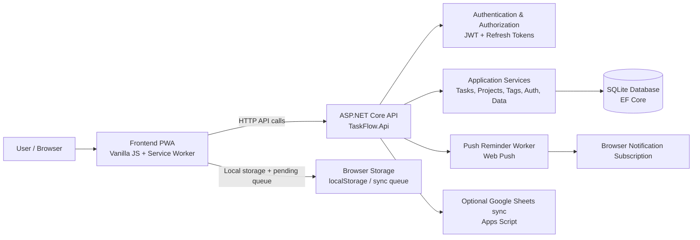
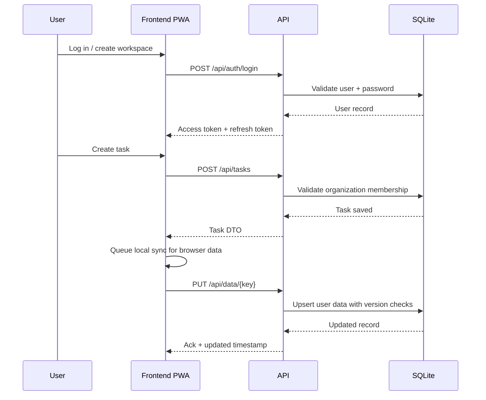

# TaskFlow Pro — Project Documentation

## 1. Overview

TaskFlow Pro is a productivity and task-tracking platform designed for personal and small-team workflows. It combines a browser-based progressive web app (PWA) with a secure ASP.NET Core API and SQLite database to provide task management, calendar-like planning, reminders, organization-level isolation, and offline-friendly syncing.

The project is intentionally split between two runtime layers:

- A frontend PWA built with vanilla JavaScript, HTML, CSS, and a service worker for offline behavior.
- A backend API built with ASP.NET Core 9, EF Core, and SQLite for authentication, task/project APIs, per-user data storage, and push notifications.

This architecture allows the app to work smoothly in a browser while keeping shared data and security boundaries on the server side.

---

## 2. Project purpose and goals

TaskFlow Pro aims to deliver:

- Task creation, editing, prioritization, due dates, and status tracking.
- Project-based organization and workspace separation.
- Reminder notifications even when the browser is closed.
- Browser-first offline operation with delayed sync when connectivity returns.
- Secure multi-user workspace boundaries through organization-scoped access.
- API-first synchronization for persistence and conflict handling.

The project is especially well-suited for:

- Individuals managing personal workload.
- Small teams or workspaces operating inside a shared organization.
- Users who want a lightweight app with strong browser convenience and server-backed security.

---

## 3. At-a-glance feature summary

### Core features

- Task lifecycle management: create, update, complete, and archive tasks.
- Projects and task organization by workspace/organization.
- Subtasks, comments, tags, and project assignment.
- Due dates, timestamps, and versioned updates.
- User-scoped browser data with server-side sync.
- Push notifications for reminders using VAPID-supported browser push.
- Offline queueing and conflict resolution for local edits.
- Authentication with username/password, JWT access tokens, and rotating refresh tokens.
- Rate limiting on auth endpoints.
- Health endpoints and readiness checks for deployment and operations.

### Product differences worth noting

The project includes both:

1. A browser-local PWA data model for offline productivity features
2. A structured server-side task/project API for organization-scoped records

These are intentionally separate models. The app’s browser-local store and the structured API do not automatically mirror each other. This separation helps preserve compatibility and avoids mixing UI state and server-managed records in the same storage model.

---

## 4. System architecture

### High-level architecture



### Request flow



---

## 5. Project structure

```text
TaskFlow-Pro/
├── README.md
├── docs/
│   ├── project-documentation.md
│   ├── user-guide.md
│   ├── verification-matrix.md
│   ├── feature-parity-matrix.md
│   ├── phase-1-audit.md
│   └── evidence/
├── frontend/
│   ├── app.js
│   ├── config.js
│   ├── index.html
│   ├── manifest.json
│   ├── sw.js
│   ├── package.json
│   ├── serve.js
│   └── tests/
├── backend/
│   ├── README.md
│   ├── Dockerfile
│   ├── railway.json
│   ├── TaskFlow.sln
│   ├── src/
│   │   ├── TaskFlow.Api/
│   │   ├── TaskFlow.Application/
│   │   ├── TaskFlow.Domain/
│   │   └── TaskFlow.Infrastructure/
│   └── tests/
│       └── TaskFlow.IntegrationTests/
├── integrations/
│   └── google-sheets/
└── .github/workflows/
```

### Key code areas

- Frontend shell and app logic: [frontend/app.js](../frontend/app.js)
- Frontend config and API base URL: [frontend/config.js](../frontend/config.js)
- Service worker and offline caching: [frontend/sw.js](../frontend/sw.js)
- API startup and routing: [backend/src/TaskFlow.Api/Program.cs](../backend/src/TaskFlow.Api/Program.cs)
- Domain entities and data model: [backend/src/TaskFlow.Domain/Entities.cs](../backend/src/TaskFlow.Domain/Entities.cs)
- Application contracts and DTOs: [backend/src/TaskFlow.Application/Contracts.cs](../backend/src/TaskFlow.Application/Contracts.cs)
- EF Core model/configuration: [backend/src/TaskFlow.Infrastructure/TaskFlowDbContext.cs](../backend/src/TaskFlow.Infrastructure/TaskFlowDbContext.cs)
- Auth and business logic: [backend/src/TaskFlow.Infrastructure/Services.cs](../backend/src/TaskFlow.Infrastructure/Services.cs)

---

## 6. Application architecture by layer

### 6.1 Frontend layer

The frontend is a dependency-light PWA built with vanilla JavaScript. It manages:

- Authentication and token refresh
- Local browser persistence and sync state
- Offline queueing for data writes
- PWA features such as installation, cache, and service worker registration
- Task UI, reminders, filters, goals, habits, notes, and other productivity elements

The app uses browser `localStorage` to hold each user’s data and queued writes. When connectivity is available, it pushes queued values to the API through authenticated endpoints.

Key frontend characteristics:

- Uses `window.TASKFLOW_CONFIG.apiBaseUrl` and `localStorage.taskflow_api_url`
- Automatically retries sync when the user returns online
- Maintains a pending queue to avoid losing writes during offline periods
- Uses optimistic concurrency checks on `/api/data` writes

### 6.2 API layer

The API is composed of `TaskFlow.Api`, `TaskFlow.Application`, `TaskFlow.Infrastructure`, and `TaskFlow.Domain`.

- `TaskFlow.Api`: HTTP endpoints, CORS, authentication, rate limiting, health checks
- `TaskFlow.Application`: command/DTO model and service boundaries
- `TaskFlow.Infrastructure`: database access, JWT issuance, push services, background worker
- `TaskFlow.Domain`: core entities and enums

The startup code in [backend/src/TaskFlow.Api/Program.cs](../backend/src/TaskFlow.Api/Program.cs) shows the main runtime setup:

```csharp
builder.Services.AddDbContext<TaskFlowDbContext>(o => o.UseSqlite(cs));
builder.Services.AddScoped<IAuthService, AuthService>();
builder.Services.AddScoped<ITaskService, TaskService>();
builder.Services.AddScoped<IProjectService, ProjectService>();
builder.Services.AddHostedService<ReminderPushBackgroundService>();
```

This is a clean layered design with the API depending on application contracts and infrastructure implementations rather than hard-wired database access.

### 6.3 Persistence layer

SQLite is used as the authoritative data store for backend-managed records. The database layer uses EF Core and defines indexes and unique constraints for key records such as:

- Users and organizations
- Organization membership
- Projects and tasks
- Refresh sessions
- User data entries
- Push subscriptions
- Reminder deduplication records

The database context also converts `DateTimeOffset` values to Unix timestamps to support SQLite ordering and comparisons reliably.

```csharp
protected override void ConfigureConventions(ModelConfigurationBuilder configurationBuilder)
{
    configurationBuilder.Properties<DateTimeOffset>().HaveConversion<DateTimeOffsetToUnixMsConverter>();
    configurationBuilder.Properties<DateTimeOffset?>().HaveConversion<NullableDateTimeOffsetToUnixMsConverter>();
}
```

This is an important implementation detail because SQLite does not natively support the same `DateTimeOffset` semantics as SQL Server or PostgreSQL.

---

## 7. Domain model

The domain includes common workspace concepts:

- `User`: account identity and password hash
- `Organization`: top-level workspace container
- `OrganizationMember`: membership and role assignment
- `Project`: grouping of tasks
- `TaskItem`: a task with title, status, priority, due date, and versioning
- `RefreshSession`: single-use refresh token tracking
- `Subtask`, `TaskComment`, `Tag`, `TaskTag`: structured task metadata
- `UserDataEntry`: per-user generic browser data store
- `PushSubscription`: browser notification subscription
- `SentReminder`: deduplication state for notifications

A representative entity summary:

```csharp
public sealed class TaskItem
{
    public Guid Id { get; set; } = Guid.NewGuid();
    public Guid OrganizationId { get; set; }
    public Guid? ProjectId { get; set; }
    public Guid CreatedById { get; set; }
    public Guid? AssigneeId { get; set; }
    public string Title { get; set; } = null!;
    public string? Description { get; set; }
    public TaskState Status { get; set; }
    public string Priority { get; set; } = "medium";
    public DateTimeOffset? DueAt { get; set; }
    public uint Version { get; set; }
}
```

The use of `Version` as a concurrency token is important, because writes can conflict when multiple clients modify the same section or task.

---

## 8. Authentication and authorization

### Authentication model

TaskFlow uses:

- Username/password registration
- JWT access tokens valid for 15 minutes
- Rotating refresh tokens valid for 30 days
- Organization-scoped claims using `sub` and `org`

The application validates the JWT and checks the user is still valid and still belongs to the organization in the token.

```csharp
var jwt = new JwtSecurityToken(
    claims: [
        new(JwtRegisteredClaimNames.Sub, u.Id.ToString()),
        new("org", org.ToString())
    ],
    expires: expiry.UtcDateTime,
    signingCredentials: new(key, SecurityAlgorithms.HmacSha256));
```

### Authorization behavior

Every protected endpoint resolves the current user and organization from the token and then checks membership before proceeding. This protects data separation across organizations.

```csharp
static Guid User(ClaimsPrincipal p) => Guid.Parse(p.FindFirst("sub")!.Value);
static Guid Org(ClaimsPrincipal p) => Guid.Parse(p.FindFirst("org")!.Value);
```

### Security behaviors included

- Username normalization to lowercase and validation
- Password length validation
- Rate-limiting on login and auth requests
- Refresh token reuse prevention and revocation
- Sticky organization membership enforcement
- `UnauthorizedAccessException` and `DbUpdateConcurrencyException` handled in middleware
- `X-Content-Type-Options` and `Referrer-Policy` response headers

---

## 9. Data sync and offline behavior

One of the most important project concepts is the split between browser-local storage and the backend API.

### Local-first sync design

The frontend writes to browser storage and queues pending writes in per-user storage keys such as:

- `taskflow_tasks_<user>`
- `taskflow_projects_<user>`
- `taskflow_activity_<user>`
- `taskflow_pending_sync_<user>`

The app then uploads the queued values to `/api/data/{key}`. This provides offline resilience and avoids losing user changes when the network is poor or temporarily unavailable.

```javascript
async function flushSyncQueue() {
  const snapshot = getPendingSync(user);
  for (const key of Object.keys(snapshot)) {
    const result = await apiRaw('/api/data/' + encodeURIComponent(key), 'PUT', {
      value: snapshot[key],
      expectedUpdatedAt: getSyncVersions(user)[key] || null,
      requireVersion: true
    }, true, user);

    setSyncVersion(key, result?.updatedAt || null, user);
    delete snapshot[key];
    setPendingSync(snapshot, user);
  }
}
```

### Conflict handling

Because browser and server state may diverge during offline use, the API allows concurrency-aware writes. If a stale update is sent, the server responds with conflict status and the local queue is retained.

This is supported by the `ExpectedUpdatedAt` and `RequireVersion` fields in `UpsertDataCommand`.

```csharp
public record UpsertDataCommand(
    string Value,
    DateTimeOffset? ExpectedUpdatedAt = null,
    bool RequireVersion = false);
```

The app will show conflict resolution screens and allow manual resolution by choosing between local and server versions.

---

## 10. Reminder and push notification system

TaskFlow includes a reminder system that can wake a browser even when the app is closed.

### How it works

- A browser registers a push subscription via `/api/push/subscribe`
- The backend stores the subscription keyed to a user
- A hosted background service scans for due reminders and sends push notifications
- Notifications are deduplicated using the `SentReminder` table

```csharp
public sealed class ReminderPushBackgroundService
    : BackgroundService
{
    // scans for due task/event reminders and delivers push notifications
}
```

The service is intentionally designed to avoid duplicating reminders and to re-arm when reminder time changes or when a failed delivery is retried.

### Why this matters

This is one of the project’s most sophisticated features: it turns task deadlines and event reminders into real browser notifications even when the app’s tab is not open.

---

## 11. Setup and installation

### Prerequisites

- .NET 9 SDK
- Node.js 20+
- A modern browser (Chrome or Edge preferred for validation)
- Optional: Docker if you want container-based deployment testing

### Backend setup

From the repository root:

```powershell
cd backend
dotnet restore TaskFlow.sln
dotnet build TaskFlow.sln
dotnet run --project src/TaskFlow.Api --launch-profile http
```

The API defaults to:

- `http://localhost:5299`
- Health endpoints: `/health/live` and `/health/ready`

Important configuration notes:

- `ConnectionStrings__TaskFlow` is required.
- `Jwt__Key` must be present and at least 32 characters.
- In production, a weak or placeholder JWT key is rejected.
- CORS origins must be allowlisted in production.

### Frontend setup

```powershell
cd frontend
npm ci
npm start
```

Then open:

- `http://127.0.0.1:8000/`
- or the subpath version if needed

The frontend checks the API URL from `frontend/config.js` and a persisted override in local storage.

### Optional Docker setup

```powershell
cd backend
docker build -t taskflow-api .
docker run --rm -p 8080:8080 --env-file .env -v taskflow-data:/data taskflow-api
```

This is useful for container deployments, though the repository also documents Railway deployment requirements.

---

## 12. How to use the app

### Typical user flow

1. Register a new account and create a workspace.
2. Log in with the generated credentials.
3. Create projects and tasks.
4. Assign tags, comments, and due dates.
5. Mark tasks as in progress or complete.
6. Enable reminders and push notifications in the app.
7. Let the app sync changes while online.
8. Continue working offline and let queued changes resolve once the browser reconnects.

### Example API usage

#### Register

```bash
curl -X POST http://localhost:5299/api/auth/register \
  -H "Content-Type: application/json" \
  -d '{
    "username": "demo_user",
    "password": "Secret123",
    "organizationName": "Demo Workspace"
  }'
```

#### Login

```bash
curl -X POST http://localhost:5299/api/auth/login \
  -H "Content-Type: application/json" \
  -d '{
    "username": "demo_user",
    "password": "Secret123"
  }'
```

#### Create a task

```bash
curl -X POST http://localhost:5299/api/tasks \
  -H "Content-Type: application/json" \
  -H "Authorization: Bearer <access-token>" \
  -d '{
    "title": "Prepare sprint demo",
    "description": "Finalize user onboarding walkthrough",
    "projectId": null,
    "assigneeId": null,
    "priority": "high",
    "dueAt": "2026-10-20T18:00:00Z"
  }'
```

---

## 13. Deployment options

### Static frontend deployment

The frontend can be deployed as static assets to GitHub Pages or any static web host. Configuration is kept separate in `config.js` and should point to the backend API origin.

### Backend deployment

The backend is designed for a single SQLite-backed API deployment. It is intended for a standard single-instance or low-traffic deployment model. The configuration and docs call out:

- Railway deployment support
- Docker build/run support
- persistent volume storage at `/data`
- explicit JWT and CORS configuration

### Deployment caveat

This project is not a distributed SaaS system with multi-replica coordination. It is a focused app that assumes one writable API instance with a persistent SQLite file and browser-based client state.

---

## 14. Testing and verification

The project includes both backend and frontend verification paths.

### Current evidence in the repository

The audit files in [docs/test-evidence.md](./test-evidence.md) record:

- backend integration tests: 24 passed, 0 failed
- frontend checks and matching keys/regression tests
- publish and restart verification
- API and frontend server health checks

Example commands:

```powershell
dotnet test backend/TaskFlow.sln --logger "trx;LogFileName=final.trx"
cd frontend
npm test
```

The project also includes a runtime validation script that exercises database persistence and startup readiness.

---

## 15. Troubleshooting

### Problem: API not reachable from the frontend

Check:

- `API_BASE_URL` in [frontend/config.js](../frontend/config.js)
- any persisted `localStorage.taskflow_api_url`
- backend is running on the expected port
- CORS configuration allows your frontend origin

### Problem: login fails unexpectedly

Check:

- username format: letters, numbers, and underscores only
- minimum password length is 6 characters
- the API JWT key is configured correctly
- backend health endpoint is reachable

### Problem: queued changes never sync

Check:

- browser is online
- login session is still valid
- server is healthy and returning a 200/204 response
- there are no unresolved conflict states blocking sync

### Problem: push notifications do not arrive

Check:

- browser permission is granted
- VAPID keys are configured
- endpoint is valid and still active
- the subscription belongs to the current user

### Problem: data conflicts appear

The project intentionally retains local data during conflicts and asks the user to resolve them explicitly. Export the backup before choosing a side.

---

## 16. Frequently asked questions

### Q: Is this a multi-tenant SaaS platform?

It is a workspace-scoped application with organization boundaries, but it is not built as a full enterprise SaaS platform with fine-grained roles, invitation flows, audit logs, or a distributed database architecture.

### Q: Is the browser storage secure?

Browser `localStorage` is not a secure security boundary. It is appropriate for convenience and offline sync, but it does not protect against an attacker who controls the same browser profile or device.

### Q: Are tasks and browser data stored in the same place?

Not exactly. The browser uses local storage for a client-side/offline queue and PWA data model; the backend stores organized, tenant-scoped records in SQLite. The two are linked by sync and API semantics, but they are not the same persistence model.

### Q: Can I deploy it with Docker or Railway?

Yes, both are supported in the repo documentation. However, the backend expects a persistent SQLite file and explicit environment variables for security-critical values.

### Q: What is the recommended production setup?

Use:

- one API instance with persistent SQLite storage
- explicit JWT secret
- trusted CORS origins
- a persistent volume for `/data`
- a static frontend deployment with the correct API URL

---

## 17. Known limitations and operational notes

The project documentation and test evidence explicitly note that not every permutation is covered. Examples of current limitations include:

- not all dynamic Arabic strings are fully translated
- push delivery and device notifications require real browser/manual verification
- some features are only operational while the app is open
- Docker Desktop/host-specific issues may depend on local environment
- the project is designed around a single-writer SQLite-backed API deployment model

These are not necessarily product defects; they are simply reminders that the project is production-conscious but intentionally scoped to a lightweight implementation.

---

## 18. Summary

TaskFlow Pro is a practical, local-first productivity system with:

- a modern browser experience,
- secure server-side authentication and organization boundaries,
- SQLite-backed task and project management,
- reminder push notifications,
- offline sync and conflict resolution,
- and a simple deployment footprint that works well for a focused team or individual workflow.

For developers, it is a useful example of a browser-first architecture with careful handling of offline data, API concurrency, and per-organization security. For stakeholders, it offers a clear value proposition: work tracking, reminders, and collaboration without requiring a heavy enterprise stack.

---

## 19. Related documentation

- [README.md](../README.md)
- [backend/README.md](../backend/README.md)
- [frontend/README.md](../frontend/README.md)
- [docs/user-guide.md](./user-guide.md)
- [docs/verification-matrix.md](./verification-matrix.md)
- [docs/test-evidence.md](./test-evidence.md)
